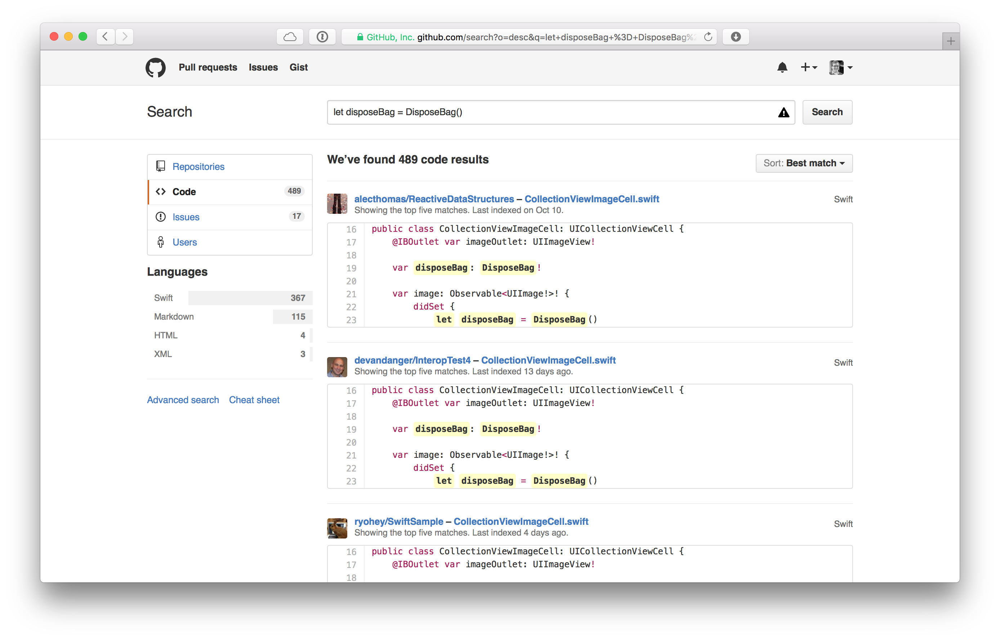

[](https://travis-ci.org/ashfurrow/NSObject-Rx)

NSObject+Rx
===========

If you're using [RxSwift](https://github.com/ReactiveX/RxSwift), you've probably encountered the following code more than a few times.

```swift
class MyObject: Whatever {
	let disposeBag = DisposeBag()

	...
}
```

You're actually not the only one; it has been typed many, many times.



Instead of adding a new property to every object, use this library to add it for you, to any subclass of `NSObject`. 

```swift
thing
  .bindTo(otherThing)
  .addDisposableTo(rx_disposeBag)
```

Sweet.

It'll work just like a property: when the instance is deinit'd, the `DisposeBag` gets disposed. It's also a read/write property, so you can use your own, too.

Installing
----------

Coming soon.

License
-------

MIT obvs.


